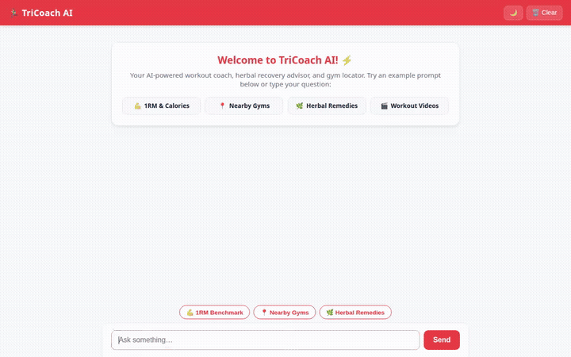

# 🏃‍♂️ TriCoach AI — Intelligent Athletic Performance & Wellness Assistant

An intelligent, multi-tool AI assistant built with the **Google Agent Development Kit (ADK)** and deployed on **Google Cloud Agent Platform**. **TriCoach AI** helps athletes, runners, and fitness enthusiasts calculate strength benchmarks, discover nearby training facilities, retrieve live outdoor weather safety advice, consult herbal remedies, generate workout illustrations and video demonstrations, and track catalog items securely.

---

## 🎬 Agent Demo



---

## ✨ Implemented Capabilities & Wired Tools

Every feature listed below is fully implemented and active in the repository (`app/`):

### 🧠 1. Persistent Memory Bank & Safety Guardrails
- **`PreloadMemoryTool` & `generate_memories_callback`**: Automatically extracts and persists user preferences and health context across chat sessions using Vertex AI Memory Bank.
- **`log_allergy`**: Explicitly logs user health constraints and dietary/medical allergies (e.g. peanuts, penicillin, latex, shellfish) to prevent unsafe athletic recommendations.

### 🖼️ 2. Gemini Multimodal Media Tools (Cloud Storage Integration)
- **`generate_workout_image`**: Generates high-quality fitness and gear illustrations using `gemini-3.1-flash-lite-image` in the `global` region. Saves the image as an ADK session artifact and uploads bytes directly to the public Cloud Storage bucket `gs://tricoach-ai-media-11b4cbda191e`.
- **`generate_workout_video`**: Generates short video demonstrations for exercises and athletic movements using `gemini-omni-flash-preview` in the `global` region. Saves the video artifact and returns its public HTTPS Cloud Storage URL.

### 📚 3. Vertex AI RAG Corpus (Culpeper Herbal Database)
- **`consult_herbal_rag_corpus`**: Queries a serverless Vertex AI RAG corpus (`culpeper-herbal-corpus`) to retrieve traditional plant remedies, natural wellness advice, and historical herbal passages.

### 🗄️ 4. Google Cloud Firestore Catalog
- **`get_firestore_catalog` & `add_firestore_item`**: Streams, filters, and manages custom catalog entries directly in Google Cloud Firestore (`catalog` collection).

### 🗺️ 5. Google Maps Geocoding & Places (New) API
- **`geocode_address`**: Converts street addresses, landmarks, or city names into exact geographic latitude/longitude coordinates.
- **`find_nearby_places`**: Uses the Google Places (New) API to discover nearby gyms, parks, sports complexes, or training centers around given coordinates.

### ☀️ 6. Live Outdoor Weather & Training Safety
- **`get_outdoor_workout_weather`**: Fetches live outdoor temperature, wind speed, weather conditions, and training safety recommendations via Open-Meteo.

### 🏋️ 7. Strength Benchmarks & Open Exercise Library
- **`calculate_1rm_and_calories`**: Computes 1-Rep Max (1RM) benchmarks using the Epley and Brzycki equations alongside estimated calorie expenditure based on body weight and duration.
- **`fetch_wger_exercise_library`**: Queries the open Wger Workout Database for target muscle groups, required equipment, and exercise execution guides.

### 🎨 8. Dynamic A2UI Render Cards & Code Sandbox Executor
- **A2UI Protocol (`a2ui-agent-sdk`)**: Formats structured responses into clean Agent-to-User Interface (A2UI) cards for UI rendering.
- **`AgentEngineSandboxCodeExecutor`**: Executes code safely within the Agent Engine Cloud Sandbox.

---

## 🛠️ Project Structure

```
.
├── app/
│   ├── agent.py               # Root ADK agent definition & system instruction
│   ├── media_tools.py         # Gemini image & video generation with GCS upload
│   ├── rag_tools.py           # Vertex AI Serverless RAG corpus retrieval
│   ├── firestore_tools.py     # Firestore document read/write catalog tools
│   ├── maps_tools.py          # Google Maps Geocoding & Places (New) API tools
│   └── a2ui_utils.py          # A2UI response formatting & callbacks
├── frontend/
│   ├── main.py                # FastAPI proxy server (A2A protocol & static hosting)
│   └── static/index.html      # Responsive web UI with light/dark themes & quick prompts
├── agents-cli-manifest.yaml   # Agent Platform deployment manifest
├── pyproject.toml             # Python dependencies and project configuration
└── demo.gif                   # Looping web demo recording
```

---

## 🚀 Setup & Local Execution

### 1. Prerequisites
- Python `3.11+`
- [`uv`](https://docs.astral.sh/uv/) package manager
- Google Cloud SDK (`gcloud`) authenticated with Application Default Credentials (`gcloud auth application-default login`)

### 2. Install Dependencies
```bash
uv sync
```

### 3. Configure Environment Variables
Copy `.env.example` to `.env` and set your credentials:
```bash
export GOOGLE_CLOUD_PROJECT="<your-gcp-project-id>"
export GOOGLE_MAPS_API_KEY="<your-google-maps-api-key>"
```

### 4. Run Local Web App
Launch the FastAPI chat proxy and web interface:
```bash
uv run python frontend/main.py
```
*Open your browser and navigate to port `8080` to chat with TriCoach AI.*

### 5. Run CLI Agent Chat
To interact with the agent directly in your terminal:
```bash
uv run agents-cli chat
```

---

## ☁️ Cloud Deployment

### Deploy Agent to Agent Platform
```bash
uv run agents-cli deploy --deployment-target agent_runtime --no-confirm-project
```

### Deploy Web Frontend to Cloud Run
```bash
gcloud run deploy frontend \
  --source ./frontend \
  --region us-east1 \
  --allow-unauthenticated \
  --set-env-vars AGENT_ENGINE_RESOURCE_NAME="<your-reasoning-engine-resource-name>",AGENT_DIRECTORY="app"
```
